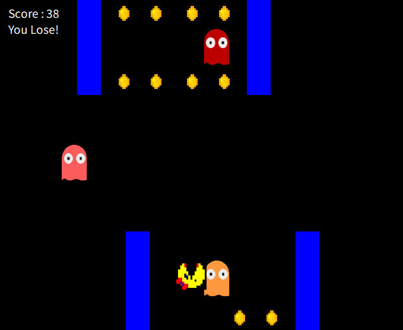

# 출처
**youtube - Moo ICT**   
https://www.youtube.com/watch?v=fdw-HGIMZFY&list=PLqOxH0kcZ8wPB5ydzHw81hGDdO85b-JsR&index=12

# flappyBird.Bounds.IntersectsWith(pipeBottom.Bounds)
flappyBird(요소1)의 경계가 pipeBottom(요소2)경계와 맞닿게 됨

# Timer
Timer는 일정한 시간 간격마다 이벤트를 발생시키는 타이머 역할

**Timer.Interval**
- 단위: 밀리초(ms)
- 타입: int
- 기본값: 100 ms  
timer1.Interval = 1000; // 1초마다 Tick 이벤트 발생