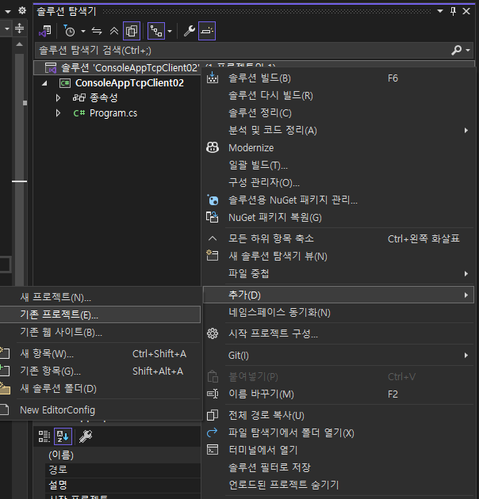
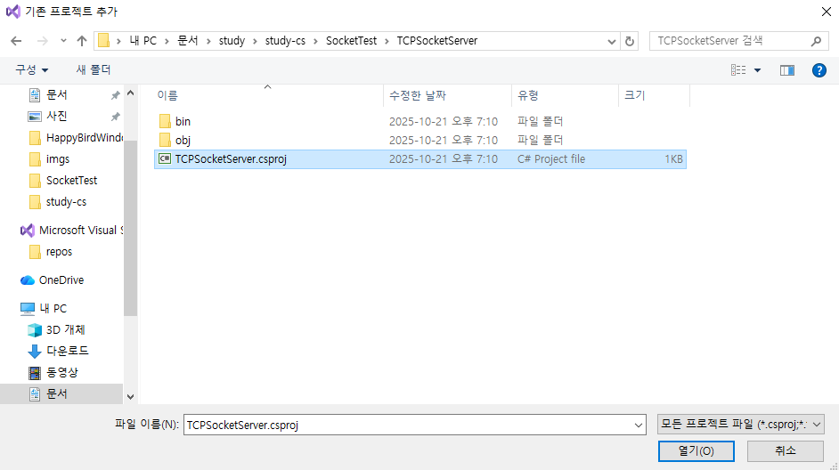
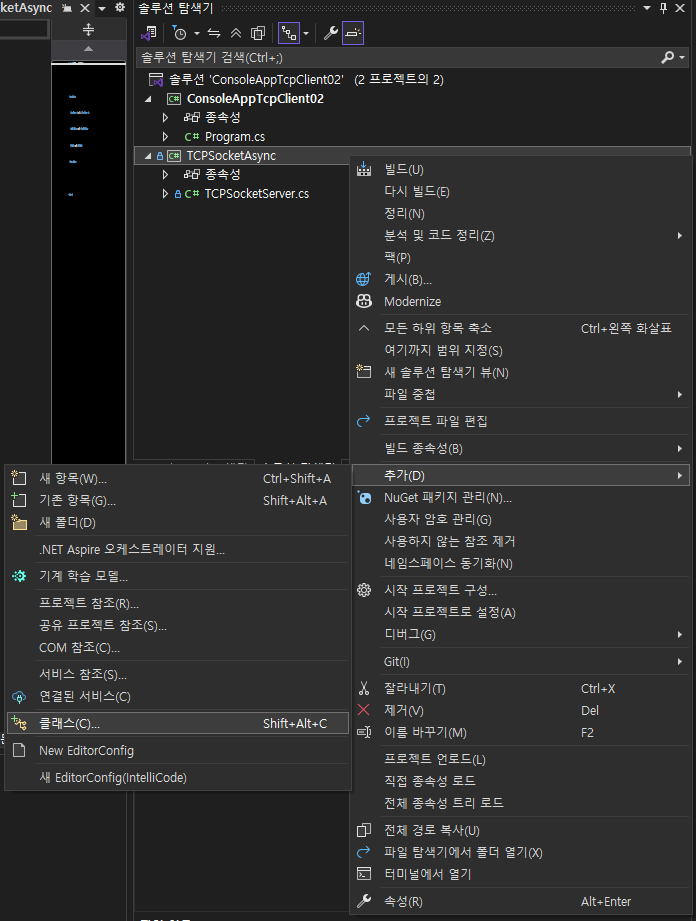
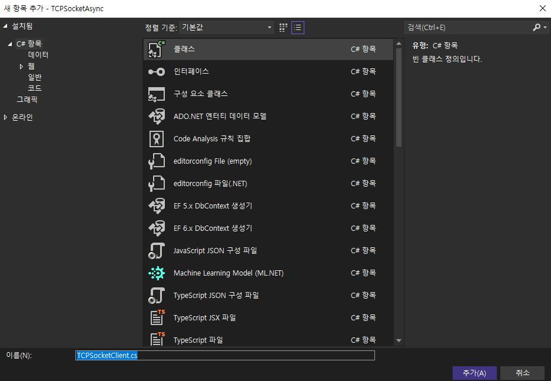
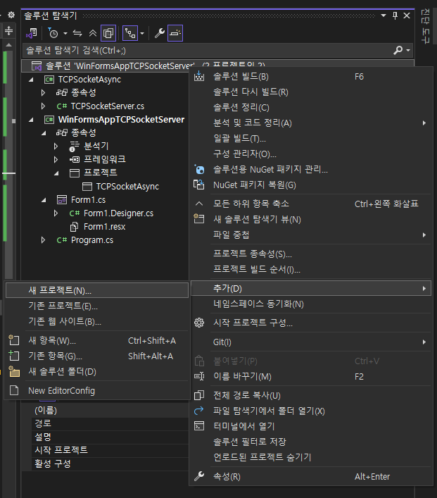
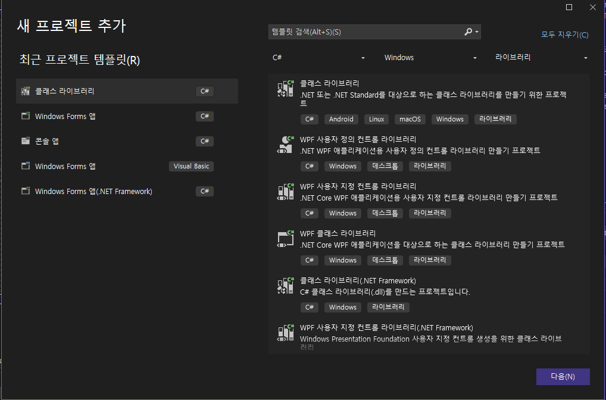
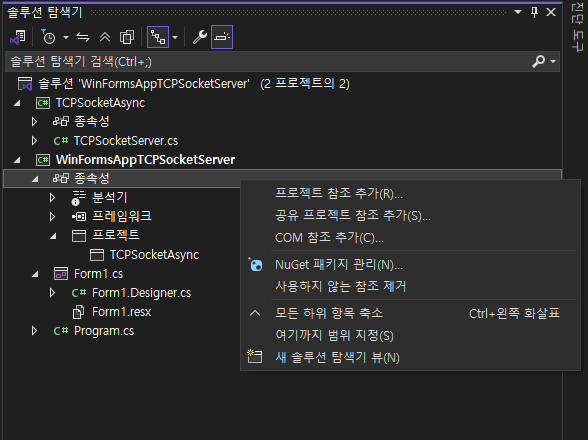
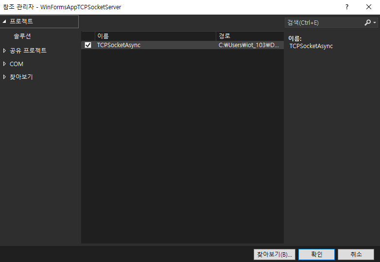
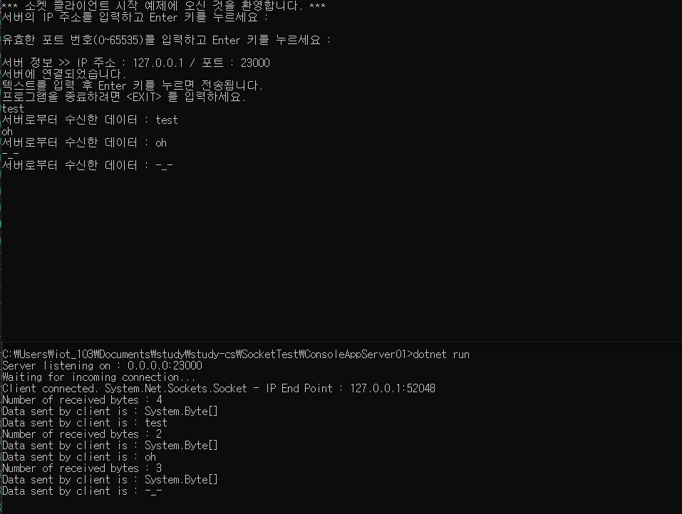

# TCP Client ()

 

# 외부 프로젝트 솔루션에 추가하게 (ConsoleAppTcpClient02)
- 솔루션탐색기(Solution Explorer) >> 솔루션오른쪽클릭 >> 추가(Add) >> 기존 프로젝트(Existing Project)

 

- csproj 열기

 

# 프로젝트에 클래스 파일 추가하기 (TCPSocketAsync)
- 솔루션탐색기(Solution Explorer) >> 클래스 라이브러리 오른쪽클릭 >> 추가(Add) >> 클래스(Class)

 

- 클래스(Class) >> 이름 작성 >> 추가

 
 
 
 
 
 
 
 
 

# TCPListener Server (WinFormsAppTCPSocketServer, TCPSocketAsync)

 

# C# 클래스 라이브러리 생성 (TCPSocketAsync)
- 솔루션탐색기(Solution Explorer) >> 솔루션오른쪽클릭 >> 추가(Add) >> 새 프로젝트(New Project)

 

- 클래스 라이브러리

 

# 솔루션 내부 프로젝트 참조하기 (WinFormsAppTCPSocketServer)
- 솔루션탐색기(Solution Explorer) >> 종속성(Dependencies) >> 프로젝트 참조 추가(Add Project Reference)

 

 
 
 
 
 
 
 
 

# Socket 서버 <<->> 클라 예제 (ConsoleAppServer01, ConsoleAppClient01)

- 상단 : 클라이언트
- 하단 : 서버

 
